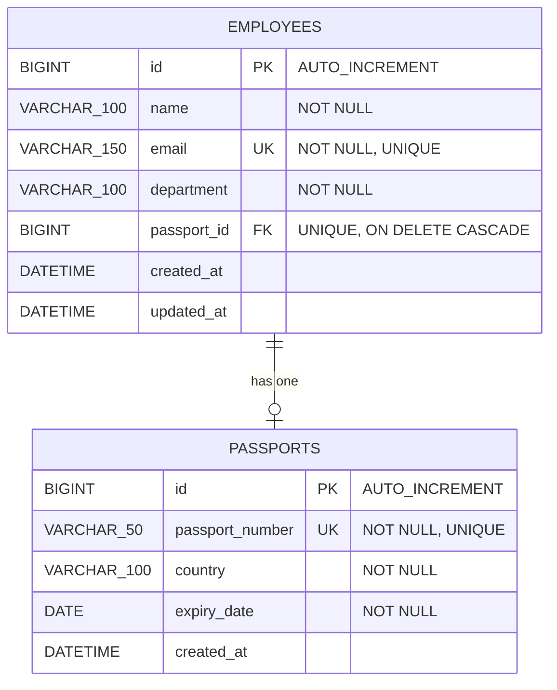

# Employee and Passport Mapping — Assignment Documentation

---

## 2. Problem Statement

The objective of this assignment is to design, develop, and deploy an enterprise-grade RESTful backend application using **Spring Boot 3** and **Hibernate / Spring Data JPA** to implement **One-to-One (`@OneToOne`) relational entity mapping** between an `Employee` and their `Passport`.

Corporate HR systems require robust mapping between employee profiles and identity documentation (such as passports), while guaranteeing relational integrity, cascade persistance, cascade deletion, unique passport assignment, and flexible retrieval without circular dependency issues.

The application exposes clean, standardized RESTful APIs to:
1. Create a new employee with or without an initial passport assignment.
2. Assign or update a passport to an existing employee.
3. Retrieve employee details along with their mapped passport information.
4. Retrieve all employees with pagination and sorting.
5. Delete an employee and automatically cascade delete their associated passport.
6. Unassign a passport from an employee.
7. Validate duplicate email addresses and duplicate passport numbers (`409 Conflict`).
8. Return standardized JSON response envelopes and proper HTTP status codes (`201 Created`, `200 OK`, `400 Bad Request`, `404 Not Found`, `409 Conflict`).

---

## 3. Project Architecture

### 3.1 Package Structure
Source code packaging follows a domain-driven structure under `com.company.epm`:

- `com.company.epm`: `EmployeePassportApplication.java` (Main entry point and ModelMapper bean).
- `com.company.epm.config`: `OpenApiConfig.java` (Swagger UI metadata configuration).
- `com.company.epm.controller`: `EmployeeController.java` (REST controller handling `/api/v1/employees`).
- `com.company.epm.dto`: `EmployeeRequestDTO.java`, `EmployeeResponseDTO.java`, `PassportRequestDTO.java`, `PassportResponseDTO.java`, and `ApiResponse.java`.
- `com.company.epm.entity`: `Employee.java` (Parent entity) and `Passport.java` (Child entity).
- `com.company.epm.exception`: `GlobalExceptionHandler.java`, `ResourceNotFoundException.java`, `DuplicateEmailException.java`, and `DuplicatePassportException.java`.
- `com.company.epm.repository`: `EmployeeRepository.java` and `PassportRepository.java`.
- `com.company.epm.service`: `EmployeeService.java` (Interface) and `EmployeeServiceImpl.java` (Implementation).

---

### 3.2 Controller Layer
- Implemented in `EmployeeController.java` using `@RestController` and `@RequestMapping("/api/v1/employees")`.
- Intercepts HTTP requests, validates DTO payloads using `@Valid`, and delegates execution to `EmployeeService`.
- Exposes REST endpoints: `@PostMapping`, `@PostMapping("/{id}/passport")`, `@GetMapping("/{id}")`, `@GetMapping`, `@DeleteMapping("/{id}")`, and `@DeleteMapping("/{id}/passport")`.
- Returns standardized `ResponseEntity<ApiResponse<T>>` objects with status codes (`201 Created`, `200 OK`).

---

### 3.3 Service Layer
- Uses `EmployeeService` (interface) and `EmployeeServiceImpl` (implementation class).
- Enforces transactional boundaries using Spring's `@Transactional` and `@Transactional(readOnly = true)`.
- Enforces unique email check (`existsByEmail`) and unique passport number check (`existsByPassportNumber`).
- Configures `@OneToOne` cascade handling (`CascadeType.ALL`), orphanRemoval for unassignment, and DTO conversion via `ModelMapper`.

---

### 3.4 Repository/DAO Layer
- `EmployeeRepository`: Extends `JpaRepository<Employee, Long>`. Custom methods:
  - `boolean existsByEmail(String email)`
  - `boolean existsByEmailAndIdNot(String email, Long id)`
  - `Optional<Employee> findByEmail(String email)`
- `PassportRepository`: Extends `JpaRepository<Passport, Long>`. Custom methods:
  - `boolean existsByPassportNumber(String passportNumber)`
  - `boolean existsByPassportNumberAndIdNot(String passportNumber, Long id)`

---

### 3.5 Entity Classes & One-to-One Mapping
- `Passport.java` (Child Entity): `id`, `passportNumber` (`VARCHAR(50)`, `UNIQUE`), `country`, `expiryDate`.
- `Employee.java` (Parent / Owning Entity): `id`, `name`, `email` (`UNIQUE`), `department`, `@OneToOne(cascade = CascadeType.ALL, fetch = FetchType.LAZY, orphanRemoval = true)` `@JoinColumn(name = "passport_id", referencedColumnName = "id", unique = true)`.

---

### 3.6 DTO Classes
- `EmployeeRequestDTO`: Input validation rules (`name`, `email`, `department`, optional `@Valid PassportRequestDTO`).
- `PassportRequestDTO`: Passport validation rules (`passportNumber`, `country`, `@Future expiryDate`).
- `EmployeeResponseDTO`: Output payload encapsulating employee fields and nested `PassportResponseDTO`.
- `ApiResponse<T>`: Generic response envelope containing `success`, `message`, `data`, `errors`, and `timestamp`.

---

### 3.7 Exception Handling
- Centralized in `GlobalExceptionHandler.java` using `@RestControllerAdvice`.
- `ResourceNotFoundException` ➔ `404 Not Found`.
- `DuplicateEmailException` ➔ `409 Conflict`.
- `DuplicatePassportException` ➔ `409 Conflict`.
- Validation errors (`MethodArgumentNotValidException`) ➔ `400 Bad Request` with field error map.

---

### 3.8 Validation
- `name`: `@NotBlank`, `@Size(min = 2, max = 100)`.
- `email`: `@NotBlank`, `@Email`.
- `department`: `@NotBlank`.
- `passportNumber`: `@NotBlank`, `@Size(min = 5, max = 50)`.
- `expiryDate`: `@NotNull`, `@Future(message = "Passport expiry date must be in the future")`.

---

### 3.9 Configuration Classes
- `OpenApiConfig.java`: Configures Swagger UI metadata accessible at `/swagger-ui.html`.
- `EmployeePassportApplication.java`: Configures `ModelMapper` singleton bean.
- Profiles: H2 in-memory DB for development (`dev`) and MySQL 8 for production (`prod`).

---

## 4. Database Design

- **Database Name**: `employee_passport_db`
- **Tables Created**: `employees`, `passports`
- **Primary Keys**: `id` (`BIGINT`, `AUTO_INCREMENT`, `PRIMARY KEY` on both tables)
- **Foreign Keys**: `employees.passport_id` ➔ `passports.id` (`UNIQUE`, `ON DELETE CASCADE`)
- **Unique Constraints**: `employees.email`, `passports.passport_number`, `employees.passport_id`

**ER Diagram Structure**:

---

## 5. API Documentation

| # | HTTP Method | Endpoint | Purpose | Expected Status Code |
|---|---|---|---|---|
| 1 | `POST` | `/api/v1/employees` | Create employee (with optional passport) | `201 Created` / `409` |
| 2 | `POST` | `/api/v1/employees/{id}/passport` | Assign/update passport to employee | `200 OK` / `400` / `409` |
| 3 | `GET` | `/api/v1/employees/{id}` | Retrieve employee with passport | `200 OK` / `404 Not Found` |
| 4 | `GET` | `/api/v1/employees` | Retrieve all employees (Paginated) | `200 OK` |
| 5 | `DELETE` | `/api/v1/employees/{id}` | Delete employee (Cascade Delete passport) | `200 OK` / `404 Not Found` |
| 6 | `DELETE` | `/api/v1/employees/{id}/passport` | Unassign passport from employee | `200 OK` / `404 Not Found` |

---

## 6. Test Cases Covered (Mandatory)

| Test Case | Expected Result | Actual Result | Status |
|---|---|---|---|
| **Create employee without passport** | Employee created with `passport = null` (`201`) | Employee created with `passport = null` (`201`) | Pass |
| **Create employee with passport** | Employee & passport created via cascade persist (`201`) | Employee & passport created via cascade persist (`201`) | Pass |
| **Duplicate passport number check** | `409 Conflict` ("Passport number already exists") | `409 Conflict` ("Passport number already exists") | Pass |
| **Duplicate employee email check** | `409 Conflict` ("Email already exists") | `409 Conflict` ("Email already exists") | Pass |
| **Cascade delete employee** | Deleting employee deletes mapped passport in DB | Deleting employee deletes mapped passport in DB | Pass |
| **Lazy/Eager loading verification** | DTO serialization retrieves passport cleanly without errors | DTO serialization retrieves passport cleanly without errors | Pass |
| **Invalid expiry date in past** | `400 Bad Request` ("Expiry date must be in future") | `400 Bad Request` ("Expiry date must be in future") | Pass |
| **Retrieve invalid employee ID (999)** | `404 Not Found` ("Employee not found with ID") | `404 Not Found` ("Employee not found with ID") | Pass |
