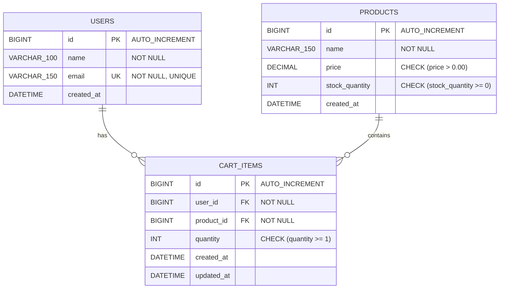

# Online Shopping Cart — Assignment Documentation

---

## 2. Problem Statement

The objective of this assignment is to design, develop, and deploy an enterprise-grade RESTful backend application using **Spring Boot 3** for an **Online Shopping Cart System**.

E-commerce applications require a robust backend to manage customer shopping carts, handle stock availability checks, prevent negative quantities, update cart items, and calculate total order amounts accurately.

The application exposes clean, standardized RESTful APIs to:
1. Add products to a user's cart while verifying stock availability.
2. View user cart details along with automatic dynamic total amount calculation.
3. Update item quantities in the cart after verifying stock availability.
4. Remove individual items from the cart.
5. Clear all items from a user's cart.
6. Enforce validation constraints (e.g. quantity must be ≥ 1, stock checks).
7. Return standardized JSON response envelopes and proper HTTP status codes (`201 Created`, `200 OK`, `400 Bad Request`, `404 Not Found`).

---

## 3. Project Architecture

### 3.1 Package Structure
Source code packaging follows a domain-driven structure under `com.shopping.cart`:

- `com.shopping.cart`: `ShoppingCartApplication.java` (Main entry point and ModelMapper bean).
- `com.shopping.cart.config`: `OpenApiConfig.java` (Swagger UI metadata configuration).
- `com.shopping.cart.controller`: `CartController.java` (REST controller handling `/api/v1/cart`).
- `com.shopping.cart.dto`: `AddToCartRequestDTO.java`, `UpdateQuantityRequestDTO.java`, `CartItemResponseDTO.java`, `CartResponseDTO.java`, and `ApiResponse.java`.
- `com.shopping.cart.entity`: `User.java`, `Product.java`, and `CartItem.java` (JPA models).
- `com.shopping.cart.exception`: `GlobalExceptionHandler.java`, `ResourceNotFoundException.java`, and `InsufficientStockException.java`.
- `com.shopping.cart.repository`: `UserRepository.java`, `ProductRepository.java`, and `CartItemRepository.java`.
- `com.shopping.cart.service`: `CartService.java` (Interface) and `CartServiceImpl.java` (Implementation).

---

### 3.2 Controller Layer
- Implemented in `CartController.java` using `@RestController` and `@RequestMapping("/api/v1/cart")`.
- Intercepts HTTP requests, validates DTO payloads using `@Valid`, and delegates execution to `CartService`.
- Exposes REST endpoints: `@PostMapping("/items")`, `@GetMapping("/user/{userId}")`, `@PutMapping("/items/{itemId}")`, `@DeleteMapping("/items/{itemId}")`, and `@DeleteMapping("/user/{userId}/clear")`.
- Returns standardized `ResponseEntity<ApiResponse<T>>` objects with status codes (`201 Created`, `200 OK`).

---

### 3.3 Service Layer
- Uses `CartService` (interface) and `CartServiceImpl` (implementation class).
- Enforces transactional boundaries using Spring's `@Transactional` and `@Transactional(readOnly = true)`.
- Validates stock availability against `product.getStockQuantity()`. Throws `InsufficientStockException` if requested quantity exceeds stock.
- Handles duplicate product addition by combining quantities and re-verifying stock availability.
- Computes cart total dynamically by summing subtotals (`price * quantity`).

---

### 3.4 Repository/DAO Layer
- `UserRepository`: Extends `JpaRepository<User, Long>`.
- `ProductRepository`: Extends `JpaRepository<Product, Long>`.
- `CartItemRepository`: Extends `JpaRepository<CartItem, Long>`. Custom methods:
  - `List<CartItem> findByUserId(Long userId)`
  - `Optional<CartItem> findByUserIdAndProductId(Long userId, Long productId)`
  - `void deleteByUserId(Long userId)`

---

### 3.5 Entity Classes
- `User.java`: Mapped to `users` table (`id`, `name`, `email`).
- `Product.java`: Mapped to `products` table (`id`, `name`, `price`, `stockQuantity`).
- `CartItem.java`: Mapped to `cart_items` table (`id`, `@ManyToOne User`, `@ManyToOne Product`, `quantity`). Derived helper method `getSubtotal()`.

---

### 3.6 DTO Classes
- `AddToCartRequestDTO`: Holds input validation rules for adding items (`userId`, `productId`, `quantity ≥ 1`).
- `UpdateQuantityRequestDTO`: Holds input validation for updating item quantity (`quantity ≥ 1`).
- `CartItemResponseDTO`: Exposes safe item details (`id`, `productId`, `productName`, `unitPrice`, `quantity`, `subtotal`).
- `CartResponseDTO`: Encapsulates overall cart metadata (`userId`, `userName`, `items`, `totalItems`, `totalAmount`).
- `ApiResponse<T>`: Generic response envelope containing `success`, `message`, `data`, `errors`, and `timestamp`.

---

### 3.7 Exception Handling
- Centralized in `GlobalExceptionHandler.java` using `@RestControllerAdvice`.
- `ResourceNotFoundException` ➔ `404 Not Found`.
- `InsufficientStockException` ➔ `400 Bad Request`.
- Validation errors (`MethodArgumentNotValidException`) ➔ `400 Bad Request` with field error map.
- `HttpMessageNotReadableException` ➔ `400 Bad Request` (Malformed JSON body).

---

### 3.8 Validation
- `userId`: `@NotNull(message = "User ID is mandatory")`.
- `productId`: `@NotNull(message = "Product ID is mandatory")`.
- `quantity`: `@NotNull(message = "Quantity is mandatory")`, `@Min(value = 1, message = "Quantity must be at least 1")`.

---

### 3.9 Configuration Classes
- `OpenApiConfig.java`: Configures Swagger UI metadata accessible at `/swagger-ui.html`.
- `ShoppingCartApplication.java`: Configures `ModelMapper` singleton bean.
- Profiles: H2 in-memory DB for development (`dev`) and MySQL 8 for production (`prod`).

---

## 4. Database Design

- **Database Name**: `online_shopping_cart_db`
- **Tables Created**: `users`, `products`, `cart_items`
- **Primary Keys**: `id` (`BIGINT`, `AUTO_INCREMENT`, `PRIMARY KEY` on all 3 tables)
- **Foreign Keys**: 
  - `cart_items.user_id` ➔ `users.id` (`ON DELETE CASCADE`)
  - `cart_items.product_id` ➔ `products.id` (`ON DELETE CASCADE`)
- **Unique Constraints**: `users.email`, `cart_items(user_id, product_id)`
- **Check Constraints**: `products.price > 0.00`, `products.stock_quantity >= 0`, `cart_items.quantity >= 1`

**ER Diagram Structure**:

---

## 5. API Documentation

| # | HTTP Method | Endpoint | Purpose | Expected Status Code |
|---|---|---|---|---|
| 1 | `POST` | `/api/v1/cart/items` | Add product to cart | `201 Created` / `400` / `404` |
| 2 | `GET` | `/api/v1/cart/user/{userId}` | View user's cart & total amount | `200 OK` / `404 Not Found` |
| 3 | `PUT` | `/api/v1/cart/items/{itemId}` | Update product quantity in cart | `200 OK` / `400` / `404` |
| 4 | `DELETE` | `/api/v1/cart/items/{itemId}` | Remove product from cart | `200 OK` / `404 Not Found` |
| 5 | `DELETE` | `/api/v1/cart/user/{userId}/clear` | Clear entire cart for user | `200 OK` / `404 Not Found` |

---

## 6. Test Cases Covered (Mandatory)

| Test Case | Expected Result | Actual Result | Status |
|---|---|---|---|
| **Add valid product to cart** | Item added & cart total calculated (`201 Created`) | Item added & cart total calculated (`201 Created`) | Pass |
| **Add zero or negative quantity (0 or -2)** | `400 Bad Request` ("Quantity must be at least 1") | `400 Bad Request` ("Quantity must be at least 1") | Pass |
| **Add product out of stock** | `400 Bad Request` ("Insufficient stock") | `400 Bad Request` ("Insufficient stock") | Pass |
| **Add with invalid product ID** | `404 Not Found` ("Product not found with ID") | `404 Not Found` ("Product not found with ID") | Pass |
| **Add with invalid user ID** | `404 Not Found` ("User not found with ID") | `404 Not Found` ("User not found with ID") | Pass |
| **View empty cart** | `200 OK` with 0 items & totalAmount=0.00 | `200 OK` with 0 items & totalAmount=0.00 | Pass |
| **Total amount calculation check** | `totalAmount` equals sum of subtotals | `totalAmount` equals sum of subtotals | Pass |
| **Duplicate product addition** | Quantity updated & stock re-verified | Quantity updated & stock re-verified | Pass |
