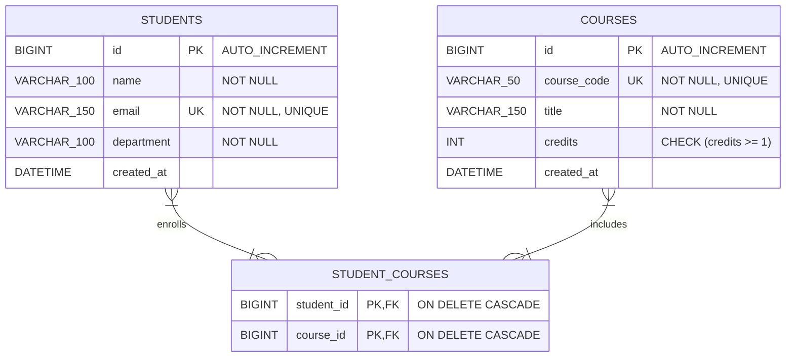

# Student Course Registration — Assignment Documentation

---

## 2. Problem Statement

The objective of this assignment is to design, develop, and deploy an enterprise-grade RESTful backend application using **Spring Boot 3** and **Hibernate / Spring Data JPA** to implement **Many-to-Many (`@ManyToMany`) relational entity mapping** between `Student` and `Course` entities using a join table `student_courses`.

Academic institutions require an efficient backend system to manage student course enrollments, catalog courses, prevent duplicate enrollments, handle un-enrollment requests gracefully, and support bi-directional data retrieval.

The application exposes clean, standardized RESTful APIs to:
1. Register new students with validation rules for unique emails and departments.
2. Create new courses with validation rules for unique course codes and positive credit values.
3. Enroll students in courses while verifying course and student existence and preventing duplicate enrollments (`409 Conflict`).
4. Remove course enrollments gracefully and reject requests to remove non-existing enrollments (`404 Not Found`).
5. View all courses registered by a specific student.
6. View all students enrolled in a specific course.
7. Return standardized JSON response envelopes and proper HTTP status codes (`201 Created`, `200 OK`, `400 Bad Request`, `404 Not Found`, `409 Conflict`).

---

## 3. Project Architecture

### 3.1 Package Structure
Source code packaging follows a domain-driven structure under `com.college.scr`:

- `com.college.scr`: `StudentCourseRegistrationApplication.java` (Main entry point and ModelMapper bean).
- `com.college.scr.config`: `OpenApiConfig.java` (Swagger UI metadata configuration).
- `com.college.scr.controller`: `StudentController.java` and `CourseController.java`.
- `com.college.scr.dto`: `StudentRequestDTO.java`, `StudentResponseDTO.java`, `CourseRequestDTO.java`, `CourseResponseDTO.java`, and `ApiResponse.java`.
- `com.college.scr.entity`: `Student.java` (Owning side with `@ManyToMany`) and `Course.java` (Inverse side).
- `com.college.scr.exception`: `GlobalExceptionHandler.java`, `ResourceNotFoundException.java`, `DuplicateEnrollmentException.java`, and `DuplicateResourceException.java`.
- `com.college.scr.repository`: `StudentRepository.java` and `CourseRepository.java`.
- `com.college.scr.service`: `CourseRegistrationService.java` (Interface) and `CourseRegistrationServiceImpl.java` (Implementation).

---

### 3.2 Controller Layer
- `StudentController`: Handles `/api/v1/students` endpoints (`registerStudent`, `getStudentById`, `getAllStudents`, `enrollStudentInCourse`, `removeEnrollment`, `getCoursesByStudentId`).
- `CourseController`: Handles `/api/v1/courses` endpoints (`createCourse`, `getCourseById`, `getAllCourses`, `getStudentsByCourseId`).
- Returns standardized `ResponseEntity<ApiResponse<T>>` objects with status codes (`201 Created`, `200 OK`).

---

### 3.3 Service Layer
- Uses `CourseRegistrationService` (interface) and `CourseRegistrationServiceImpl` (implementation class).
- Enforces transactional boundaries using `@Transactional` and `@Transactional(readOnly = true)`.
- Validates student and course existence. Throws `ResourceNotFoundException` if missing.
- Prevents duplicate enrollments (`DuplicateEnrollmentException` ➔ `409 Conflict`).
- Manages bi-directional relationships via `student.addCourse(course)` and `student.removeCourse(course)`.

---

### 3.4 Repository/DAO Layer
- `StudentRepository`: Extends `JpaRepository<Student, Long>`. Includes JPQL fetch join `findWithCoursesById(Long id)`.
- `CourseRepository`: Extends `JpaRepository<Course, Long>`. Includes `existsByCourseCode(String courseCode)`.

---

### 3.5 Entity Classes & Many-to-Many Mapping
- `Course.java`: `id`, `courseCode` (`VARCHAR(50)`, `UNIQUE`), `title`, `credits`, `@ManyToMany(mappedBy = "courses") Set<Student> students`.
- `Student.java`: `id`, `name`, `email` (`UNIQUE`), `department`, `@ManyToMany` `@JoinTable(name = "student_courses", joinColumns = @JoinColumn(name = "student_id"), inverseJoinColumns = @JoinColumn(name = "course_id")) Set<Course> courses`.

---

### 3.6 DTO Classes
- `StudentRequestDTO`: Input validation rules (`name`, `email`, `department`).
- `CourseRequestDTO`: Input validation rules (`courseCode`, `title`, `credits ≥ 1`).
- `StudentResponseDTO`: Output payload containing student attributes and `Set<CourseResponseDTO> courses`.
- `CourseResponseDTO`: Output payload containing course details.
- `ApiResponse<T>`: Generic response envelope containing `success`, `message`, `data`, `errors`, and `timestamp`.

---

### 3.7 Exception Handling
- Centralized in `GlobalExceptionHandler.java` using `@RestControllerAdvice`.
- `ResourceNotFoundException` ➔ `404 Not Found`.
- `DuplicateEnrollmentException` ➔ `409 Conflict`.
- `DuplicateResourceException` ➔ `409 Conflict`.
- Validation errors (`MethodArgumentNotValidException`) ➔ `400 Bad Request` with field error map.

---

### 3.8 Validation
- `name`: `@NotBlank`, `@Size(min = 2, max = 100)`.
- `email`: `@NotBlank`, `@Email`.
- `courseCode`: `@NotBlank`, `@Size(min = 2, max = 50)`.
- `credits`: `@NotNull`, `@Min(1)`.

---

### 3.9 Configuration Classes
- `OpenApiConfig.java`: Configures Swagger UI metadata accessible at `/swagger-ui.html`.
- `StudentCourseRegistrationApplication.java`: Configures `ModelMapper` singleton bean.
- Profiles: H2 in-memory DB for development (`dev`) and MySQL 8 for production (`prod`).

---

## 4. Database Design

- **Database Name**: `student_course_db`
- **Tables Created**: `students`, `courses`, `student_courses` (Join Table)
- **Primary Keys**: `id` on `students` and `courses`, Composite PK `(student_id, course_id)` on `student_courses`.
- **Foreign Keys**: 
  - `student_courses.student_id` ➔ `students.id` (`ON DELETE CASCADE`)
  - `student_courses.course_id` ➔ `courses.id` (`ON DELETE CASCADE`)
- **Unique Constraints**: `students.email`, `courses.course_code`

**ER Diagram Structure**:

---

## 5. API Documentation

| # | HTTP Method | Endpoint | Purpose | Expected Status Code |
|---|---|---|---|---|
| 1 | `POST` | `/api/v1/students` | Register a new student | `201 Created` / `409` |
| 2 | `POST` | `/api/v1/courses` | Create a new course | `201 Created` / `409` |
| 3 | `POST` | `/api/v1/students/{studentId}/enroll/{courseId}` | Enroll student in course | `200 OK` / `409` / `404` |
| 4 | `DELETE` | `/api/v1/students/{studentId}/unenroll/{courseId}` | Remove enrollment | `200 OK` / `404 Not Found` |
| 5 | `GET` | `/api/v1/students/{studentId}/courses` | View courses enrolled by student | `200 OK` / `404 Not Found` |
| 6 | `GET` | `/api/v1/courses/{courseId}/students` | View students registered in course | `200 OK` / `404 Not Found` |

---

## 6. Test Cases Covered (Mandatory)

| Test Case | Expected Result | Actual Result | Status |
|---|---|---|---|
| **Register valid student** | Student created (`201 Created`) | Student created (`201 Created`) | Pass |
| **Create valid course** | Course created (`201 Created`) | Course created (`201 Created`) | Pass |
| **Enroll student in course** | Link created in `student_courses` (`200 OK`) | Link created in `student_courses` (`200 OK`) | Pass |
| **Duplicate enrollment attempt** | `409 Conflict` ("Already enrolled in course") | `409 Conflict` ("Already enrolled in course") | Pass |
| **Enroll invalid student ID (999)** | `404 Not Found` ("Student not found with ID") | `404 Not Found` ("Student not found with ID") | Pass |
| **Enroll invalid course ID (999)** | `404 Not Found` ("Course not found with ID") | `404 Not Found` ("Course not found with ID") | Pass |
| **Remove non-existing enrollment** | `404 Not Found` ("Student is not enrolled in course") | `404 Not Found` ("Student is not enrolled in course") | Pass |
| **Lazy loading verification** | DTO serialization retrieves courses cleanly without errors | DTO serialization retrieves courses cleanly without errors | Pass |
